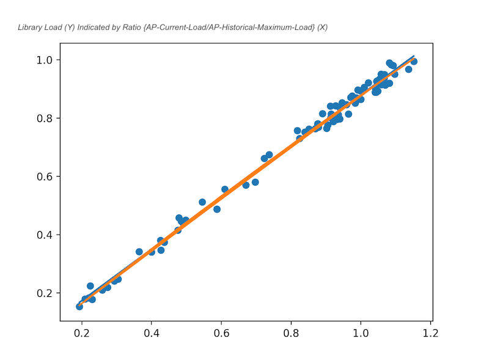

# LGU Heatmap


```2503 Smart City``` Final Project Made by A Group with Members:
* **Zhu Chuyan**
* Zhang Yizhan
* Hu Zexi

## I. Main idea
The main idea of the project is to use the terminal devices connected to campus wireless network
including laptops and cell-phones and extract the data of Wi-Fi connections from
http://10.10.10.10 with web crawler (**as we do not have access to the API**), then send the collected data to the server. After the server
receives these data, it decodes and organises them insert them as a record into a csv file.

Apart from this, a website is hosted on the same server, providing an interface to check the heatmap.
And the mapping between the load of APs and load of people (heatmap) are derived
based on some statistical analysis with the help of the **numpy** library.

## II. File Structure
```shell
+-- README.md
+-- README.pdf
+-- plot.py                       # derive the mapping from here
+-- client_releases               # client applications (collecting data)
|   +-- LGUW_for_mac.app
|   +-- LGUW_for_android.apk
|   +-- LGUW_for_iOS.url          # shortcut is used for iOS client
+-- client_src_android
|   +-- app/src/main/java/com/cuhk/lguw/RunAfterBootService.java
|   +-- ...                       # source code for android client
+-- client_src_py
|   +-- client.py                 # laptop client main entry
|   +-- CUHK
    |   +-- __init__.py
    |   +-- Wireless.py           # laptop client library
|   +-- icon.icns                 # icons for client applications
+-- server_receiver
|   +-- server.py                 # receiving collected data with socket
|   +-- iOS_server.py             # designated for iOS shortcut
|   +-- delete.py                 # clean record data by keywords
+-- server_web                    # based on Django
|   +-- config.py                 # csv and customisable configs set here
|   +-- home
    |   +-- fetch
        |   +-- __init__.py
        |   +-- run.py            # data retrieval lib for web
|   +-- manage.py                 # management by and for Django
|   +-- ...
```
## III. Brief Introduction
To use the AP to for heap-map analysis, two elements is very important:
* Sufficient Data:
This is very important especially when our goal is real-time heat-map, which
involves both the dimension of location and time. We need to fulfil the locaiton-time vector space as much
as possible. However, after our query to the ITSO, we are informed that we have no access
to the API of AP connections statistics. Therefore, I come out with a solution when I observe
the campus **Network Report** site http://10.10.10.10, the access of which everyone connected to
the campus network is granted with. Using **web crawler technologies**, we can get the information of
the AP we are currently connected. To get enough data, we developed **client applications** on multiple
platforms using ```Python``` and ```Java``` and ask our friends' favours to install them on their devices
acting as the antenna for us. The data collected is sent back to my personal server in *Los Angeles, CA* through
```socket``` communications
* Mapping Between **AP Connection Numbers** And **Heat Map**: one person may have multiple
devices connected to Wi-Fi in modern days, and we are not able to cover the data of every AP
which may cause a lot of bias. Therefore, we calculate the load of each AP by **calculating its
current connections with historic max connections**, taking the average of all APs in a particular
area and then further compare it with the historic max. To prove this mapping actually works and to
improve the accuracy, we use 1/F University Library as a experimental field and counted the **real people
load** (occupied seats/all seats) and **record the AP load we derive**. With about 70 lines of experimented data,
we use numpy library to examine (see ```plot.py```) the best polynomial mapping function between derived AP load and people load,
finding that the best match is **linear**: ```Man_Load = 0.88262526*AP_Load-0.00297941```


**Key Files:**
* ```plot.py``` to **derive the mapping formula**;
* ```client_src_py/CUHK/wireless.py``` for **client-side web crawler**;
* ```server_web/home/fetch/run.py``` for **server-side data retrival** (to prevent excessive data reading, we develop a **cache mechanism** which may create a lot of log files that will not update until the preset interval, for example 3 minutes)
* *For more files information please refer to the ```II. File Structure``` part*

## IV. How to Test
As the data is collected through my personal server, it will be best that you visit the web we
set up directly to check the ever-updating latest data: http://philipnetwork.com. However, if you want to run locally, please go to server_web/config.py
and set the datafield CSV_PATH to the valid csv path (a csv is attached with the code, but it is out-dated and not real-time data for sure). Then you can run:
```shell
# before running:
# make sure that you have installed the django related prerequisites
# make sure that your local 8080 port is not occupied
# you may replace 'python' with your desired version/path of Python
python server_web/manage.py runserver
```
## V. Course Contents We Have Utilised
* Sensors: we use terminal mobile devices such as cell phones to collect the desire information
* Network: we use a client-server model and use Internet for communications (multi-thread socket is used)
* Data analysis: we use ```numpy``` library and experimental data collected by ourselves to derive the mapping function between the man load and the ap load
